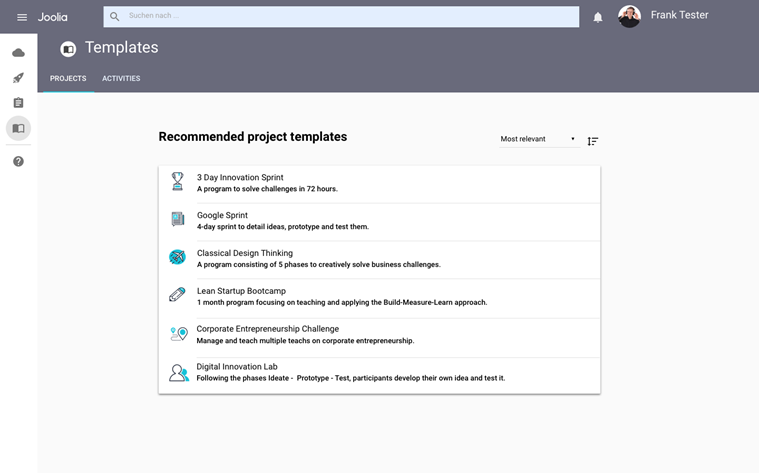
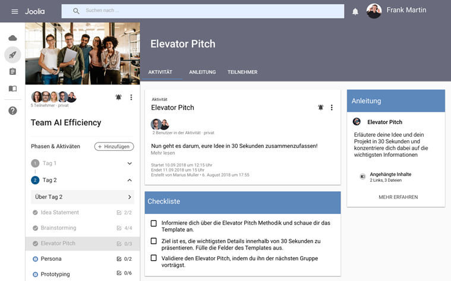
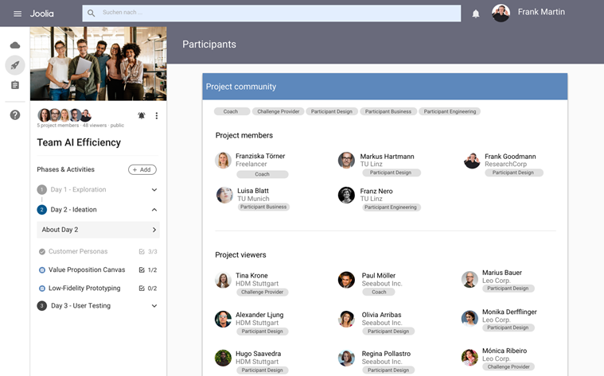

# Joolia

## Welcome to Joolia

A plattform to support your innovation!

Joolia enables the management and organization of agile innovation formats.

### Preparation
  
For preparation, it contains templates for different formats and methods, supports
innovations, communication with participants and last but not least, the teambuilding
process.  

### Execution
  
It manages training content and information for the participants, provides an overview
over the progress and the results. It engages stakeholders and supports final documentation of the outcomes.

### Follow-up
  
Afterwards it helps access the resulting documents, supports the repetition and rescaling of a successful format
and helps to stay in touch with all stakeholders.

## Make it run

Take a look at [the server readme](joolia-server/README.md) and at [the client readme](joolia-client/README.md).

## Copyright & License
Copyright © 2023 msg systems AG
Licensed under GPL v3.0
