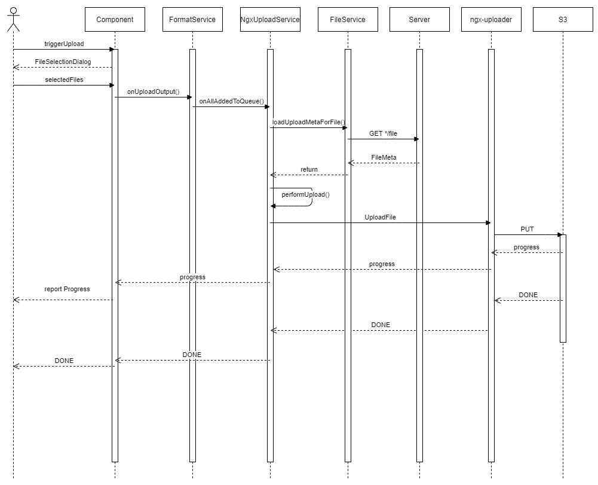

# Handling Files 

- Used NPM Package  
  ngx-uploader
- Related Files  
  src/app/core/services/ngx-upload.service.ts
  src/app/core/services/file.service.ts

## File Upload

**Options for uploading**  
There are two approaches for uploading files: 
- Upload after confirmation 
    e.g. Submission
- Auto Upload after file selection (allAddedToQueue) 
    e.g. FormatService 
  
Defined in the global-config 
- concurrency 
- maxUploads

**Model**  
The Model definition for the files is in:  
src/app/core/models/file-meta.model.ts  

- Attribute upload  
For handling the files in ngx-uploader the attribute "upload" is relevant.  
This is used for the communication between the components and the fileUpload itself when uploading 

- file.id vs. file.upload.id   
These two ID´s are handled by two different Components.  
  file.upload.id is controlled by ngx-upload service  
  file.id is controlled by the joolia server

### Description

**NgxUploadService**  
NgxUploadService is a wrapper for the implementation of ngx-uploader.  
This service:
- is instantiated as singleton and thus handling all uploads within Joolia.
- used by services e.g. formatService for uploading

**FileService**  
Is in charge of handling the correct endpoints to handle the files on server side. 
The dependency on the endpoint is:  
- The parent entity: e.g. Format, ...  
- The kind of the file: e.g. File, KeyVisual, ...  

**Steps of uploading**  
Rough description. The implementation is more extensive than described in the sequence diagram e.g. multiple fileupload, canel uploads, ...  

#### Block leaving the page while uploading
By uploading files especially bigger files the user needs to get the information, that the upload is not yet finished, and he needs to stay on the page to finalize the upload.
This is realized by watching the Upload status in   
- src/app/core/guards/file-upload.guard.ts
- src/app/app.component.ts

#### Upload a File and the ServiceWorker
Description see: https://github.com/w3c/ServiceWorker/issues/1141  
In our implementation this is handled in  
src/app/core/services/ngx-upload.service.ts  
performUpload()  
headers: { ..., 'ngsw-bypass': 'true' }

## File Download 

Client requires to have two ways of querying a file: 

- Display a file e.g. Avatar 
- Download a file e.g. Files in Format Details 

After the server received a request for a file he is generating a signed URL for accessing the object in the S3-Bucket.  
The signed URL is valid for a defined time. 

### Description

The behaviour is controlled by setting a specific URL Query parameter

- ?download=true  
for downloading a file  
- ? download=false  
to embed and display a file
  
Result is that we get additionally different [Content-Disposition Header](https://developer.mozilla.org/en-US/docs/Web/HTTP/Headers/Content-Disposition) back.
