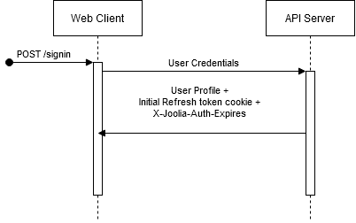
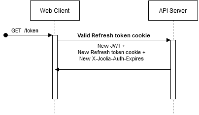

Updated on 24.11.2020

# Authentication

Joolia's authentication mechanism relies on [httpOnly](https://owasp.org/www-community/HttpOnly) cookies and [JWT](https://jwt.io/). Note that there is a CSRF protection implemented to mitigate the risk of [Cross-site Request Forgery](https://owasp.org/www-community/attacks/csrf). 

# API Calls validation 

API client must have a valid JWT token to call the secured endpoints. The JWT is extracted from the standard `Authorization` HTTP header or from the cookie sent along with the request.

# API Endpoints

These endpoints are used during the authentication process, assuming the user is already registered in the platform.

## POST /signin

Accepts user credentials (email & password) and returns the __User Profile__ in the body. Server sets a __JWT cookie__ (httpOnly) along with the `X-Joolia-Auth-Expires` HTTP header that tells the API client how long the JWT token is valid.

## GET /token

Refreshes current User's Authorization token replying with a new JWT token and its new expiration time. It will set the new cookie too with the new extended lifespan. This endpoint should be called periodically by API clients before the expiration time is reached.

## POST /signout

Invalidates User's Authorization by setting an expired authorization cookie.
