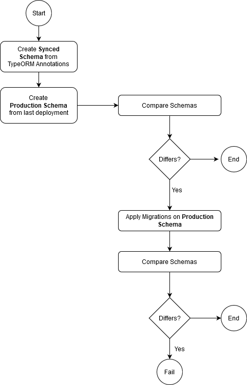

Updated on 24.11.2020

# Database Migration

Tools & documentation to handle __MySQL__ Database Migration.

# Rationale

Joolia keeps the knowledge of its Entity Relationship models in code, through annotation with
the help of __TypeORM__ framework. It is possible to use the TypeORM Client to keep the models
in code, and the database schema in sync. While this works most of the time in development environments
it is not a recommended approach for production because the chances to lose data or having the
schema in an inconsistent state is very high (i.e, a column can be easily dropped through TypeORM
synchronization). 

The current approach is to apply migration scripts for every change needed in the ER model, that
means the developer still use TypeORM annotations but instead of using the synchronization automatically
it is advised to write migration scripts, hence these scripts will be tested since the early stages
of development and increases the chances of success in production environment. 

The purpose of `db/update.sh` tool can be summarized as:

1. Compare the state of production Schema with the Schema generated from the annotations
2. When the production differs from development tries to apply migration
3. Compares the migrated Schema with production again.

__Note__: This document is kept as best effort basis. In case something is wrong, please, fix it!

# Folder Structure

Below you find the rationale for this folder layout.

    .
    ├── configurations                          (TypeORM client configurations)
    │         ├── ormconfig-ci-jooliadb.yml
    │         ├── ormconfig-dev-jooliadb.yml
    │         ├── ormconfig-fixtures.yml
    │         ├── ormconfig-prod-jooliadb.yml
    │         └── ormconfig-staging-jooliadb.yml
    ├── deployments                             (Last schemas deployed in production, is not a backup!)
    │         ├── 20191001-jooliadb.sql
    │         ├── 20191025-jooliadb.sql
    │         ├── 20191114-jooliadb.sql
    │         └── schemadump.sh
    ├── migrations                              (Migrations are kept here through TypeORM client)
    │         └── archived                            (Completed migrations)
    │         └── 1570177527255-ActivityFieldsAdjustments.ts
    ├── procedures                              (Triggers, Views, Initial Data & PL SQLs)
    │         ├── stored-procedures.sql
    │         ├── triggers.sql
    │         ├── views.sql
    │         └── populate.sql
    ├── README.md
    ├── commons.sh
    └── update.sh
 
# Requirements

+ Linux compatible OS
+ MySQL 5.7 running locally on port 3306
+ MySQL Client 5.7 tools (mysql, mysqldump)
+ Bash Interpreter
+ Set `log_bin_trust_function_creators` (https://dev.mysql.com/doc/refman/5.7/en/stored-programs-logging.html)

Note: Windows environment is not supported. See `JOOLIA-1274`.

# The Update script

The script `db/update.sh` is responsible to keep in sync the required schemas, stored procedures and triggers required by Joolia's archiving and deletion solution in all supported environments.

Joolia's environment consists of:

+ Jenkins CI - started in a docker container. See `Jenkinsfile`.
+ Development - started in a docker container locally for development.
+ Staging - started in a docker container deployed on Kubernetes.
+ Production - AWS RDS Instance.

In __all environments__ the __automatic synchronization__ of the schema through
TypeORM is __turned off__ by default hence you must use the setup script. That performs the
following tasks:

1. Schemas are __dropped and recreated__, collation and encoding configured.
2. Main Schema is synchronized via TypeORM
3. Main Schema is compared against latest deployed production schema
4. Migrations are performed (if any) using TypeORM client
5. Archive Schema is recreated using the Main Schema
6. Create Triggers, Views and Stored Procedures
7. Drop constraints from the Archive Schema

Each supported environment has its own configuration, see the YAML files.

## First time database setup

Whenever you're starting in development or switching between tasks that differs at schema level it is advised
to issue a new database setup:

    npm run db:setup
    
__ATTENTION__: This procedure will destroy all data in the local database.

## Loading Fixtures (development)

In order to test locally you need to set up the initial database state with the fixtures.

    npm run db:setup && npm run fixtures

## Populate EMPTY tables (development)

__THIS IS NOT THE SAME AS FIXTURES__

This procedure will populate the database with the __required static data__ in order to run the solution. 

    npm run db:init
    
This brings the initial state of the database without any customer related data. Empty State.

Inspect the current data to be loaded in `db/procedures/populate.sql`. If the data needs to be updated or
new tables are added that requires to be initialize then this solution needs to be improved. See JOOLIA-2244.
    
## Adding new migrations

__TypeORM__ can detect model (entity annotation) changes in code and generate a migration script automatically. In order to generate migration scripts, the npm task __migration:generate__ can be used, after the code reflects the model changes. This is configured for development environment, since this process will be performed only locally during model adjustments.
The task requires the __name of the migration__ as input.

Before you proceed you need the last known state of the Models hence run the following command:

    npm run db:setup

then create the migration files:

    npm run migration:generate -- -n MyNewMigration
 
This will generate the script __./db/migrations/{TIMESTAMP}-MyNewMigration.ts__

In case there are no schema changes you can still create a migration to manipulate data:

    npm run migration:create -- -n FixSomeDataProblem
    
This will generate an __empty script__ __./db/migrations/{TIMESTAMP}-FixSomeDataProblem.ts__

__Important 0__: This procedure will generate code automatically, __inspect__ it! Read [this! Really!](https://github.com/typeorm/typeorm/issues/3357)

__Important 1__: Remove the generated code for the `down` method. Look previously migrations in the `archived` folder. __Currently, we do not need them__.

If everything is good you should be able to apply the migrations running again `npm run db:setup`.

### Migration Limitations

1. The generated script **WILL NOT** take into consideration the related Triggers or Procedure. In case
you have renamed any table take care of the correspondent Triggers or Procedures that references it.

# Dry-run Migrations for a Production-like environment

The data plays an important role during migration, and it's not guaranteed that all the precautions
taken following this guide will be enough when dealing with real data. For __big schema changes__ is recommended
to take a sample/dump from a production-like environment and test the procedure earlier, if it's possible.

See [here](https://bitbucket.org/ideasuite/joolia-devops/src/master/docs/Tips.md) how to retrieve a sample from
production environment.

1. Restore the last known Production Schema state.

    npm run db:restore

2. Load the data into the database. Note you only need the data, the schema was restored in the first step.

    mysql -h 127.0.0.1 -u root -padmin jooliadb < jooliadb-data-only.sql

3. Dry-run/simulate the migration locally. This step will apply the pending migration on top of the
restored schema with the data loaded previously. If everything goes fine there is a bigger chance
the migration will run smoothly in production environment.

    npm run migration:sim

# Limitations, Known Issues & Improvements

+ No rollbacks are performed. Be sure to have backups, specially in __production__
+ For __non-production__ environments the fixtures are not loaded before applying migration hence
there is still a chance the migration procedure fails in production.
+ Views are not supposed to be tracked or migrated. New views will certainly break the current
detection mechanism hence the `update.sh` script might need adjustment to ignore.
+ The `jooliadb_archive` schema is never migrated (but will be, see JOOLIA-1909) instead should be recreated in every migration.
The migration script asks before dropping it, if you are sure the archive schema is compatible with the
new main schema (after migration) then you can choose to keep it. Your call.
